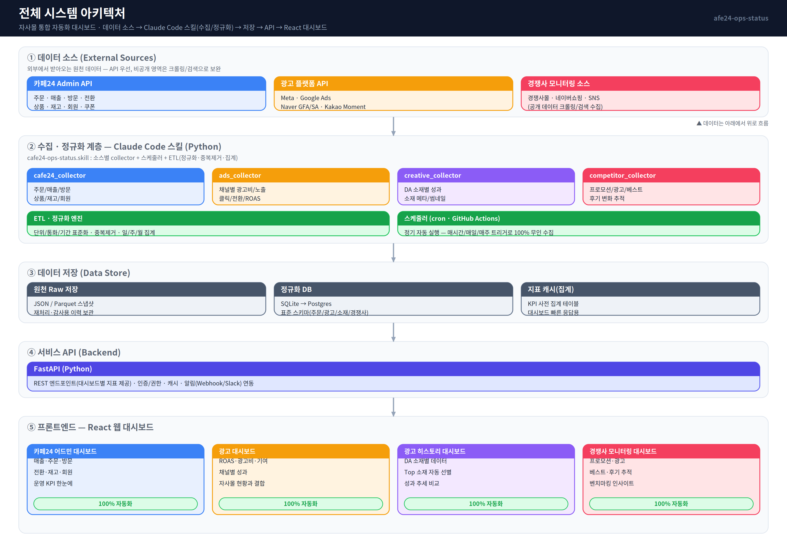
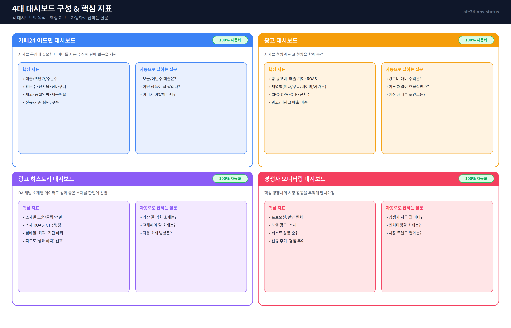
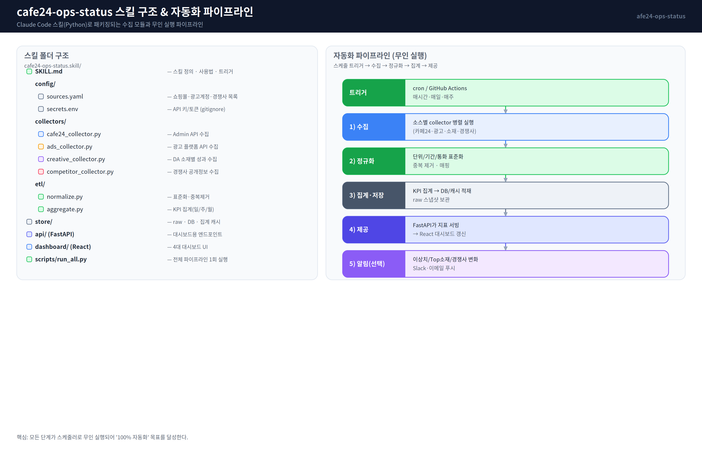
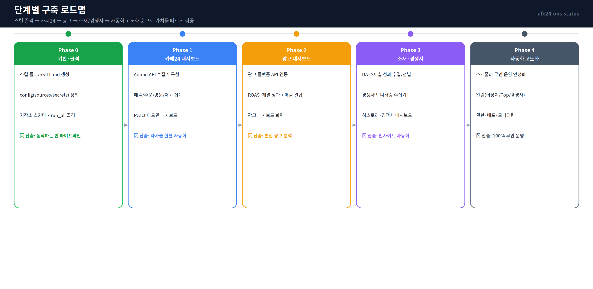

# 자사몰 통합 자동화 대시보드 — 설계도면

> 카페24 전용 운영현황 대시보드. **Claude Code 스킬(`cafe24-ops-status.skill`) + Python**으로 데이터를
> 100% 자동 수집·정규화하고, **React 웹 대시보드**로 4개 영역을 시각화한다.

- **산출물**: React 웹 대시보드
- **데이터 소스**: 카페24 Admin API · 광고 플랫폼 API · 경쟁사 공개 데이터(크롤링/검색)
- **수집/처리**: Claude Code 스킬(Python) + 스케줄러로 무인 실행
- **이 문서의 범위**: 전체 아키텍처 설계도면(이미지) — 구현은 다음 단계

---

## 1. 전체 시스템 아키텍처



데이터는 **아래에서 위로** 흐른다.

| 계층 | 역할 |
|------|------|
| ① 데이터 소스 | 카페24 Admin API, 광고 플랫폼 API(Meta·Google·Naver·Kakao), 경쟁사 공개정보 |
| ② 수집·정규화 (스킬) | 소스별 `collector` + 스케줄러 + ETL(표준화·중복제거·집계) |
| ③ 데이터 저장 | 원천 Raw(JSON/Parquet) → 정규화 DB(SQLite→Postgres) → 지표 캐시 |
| ④ 서비스 API | FastAPI — 대시보드별 지표 서빙, 인증/권한, 알림 연동 |
| ⑤ 프론트엔드 | React 웹 대시보드 (4개 영역) |

---

## 2. 4대 대시보드 구성 & 핵심 지표



1. **카페24 어드민 대시보드** — 매출·주문·방문·전환·재고·회원 등 자사몰 운영 KPI 자동 수집
2. **광고 대시보드** — 자사몰 현황 + 광고 현황을 결합해 ROAS·채널 효율 분석
3. **광고 히스토리 대시보드** — DA 채널 소재별 데이터로 성과 좋은 소재 자동 선별
4. **경쟁사 모니터링 대시보드** — 경쟁사 프로모션·광고·베스트·후기 추적 → 벤치마킹

4개 모두 **100% 자동화**가 목표(무인 수집·갱신).

---

## 3. 스킬 구조 & 자동화 파이프라인



```
cafe24-ops-status.skill/
├── SKILL.md                 # 스킬 정의 · 사용법 · 트리거
├── config/
│   ├── sources.yaml         # 쇼핑몰·광고계정·경쟁사 목록
│   └── secrets.env          # API 키/토큰 (gitignore)
├── collectors/
│   ├── cafe24_collector.py
│   ├── ads_collector.py
│   ├── creative_collector.py
│   └── competitor_collector.py
├── etl/
│   ├── normalize.py
│   └── aggregate.py
├── store/                   # raw · DB · 집계 캐시
├── api/                     # FastAPI 엔드포인트
├── dashboard/               # React 4대 대시보드 UI
└── scripts/run_all.py       # 전체 파이프라인 1회 실행
```

**파이프라인**: `트리거(cron/GitHub Actions) → 수집 → 정규화 → 집계·저장 → API 제공 → (선택) 알림`.
모든 단계가 스케줄러로 무인 실행되어 "100% 자동화"를 달성한다.

---

## 4. 단계별 구축 로드맵



| Phase | 목표 | 산출 |
|-------|------|------|
| Phase 0 | 기반·골격 | 동작하는 빈 파이프라인(스킬 골격) |
| Phase 1 | 카페24 대시보드 | 자사몰 현황 자동화 |
| Phase 2 | 광고 대시보드 | 통합 광고 분석 |
| Phase 3 | 소재·경쟁사 | 인사이트 자동화 |
| Phase 4 | 자동화 고도화 | 100% 무인 운영 |

---

## 5. 확인이 필요한 결정 사항 (다음 단계 전)

- **카페24 인증 방식**: Admin API OAuth 앱 발급 / `mall_id`·토큰 관리 주체
- **광고 플랫폼 범위**: 1차로 어느 채널부터(Meta·Google·Naver·Kakao 중)
- **경쟁사 모니터링 방식**: 공개 페이지 크롤링 / 네이버·검색 API 활용 범위, 대상 경쟁사 목록
- **저장소·호스팅**: 로컬 SQLite로 시작 → 운영 시 Postgres/클라우드 전환 시점
- **스케줄러**: GitHub Actions(무인) vs 별도 서버 cron

---

## 도면 재생성

```bash
cd docs/afe24-ops-dashboard/diagrams
pip install cairosvg          # + 한글 폰트(fonts-noto-cjk)
python3 generate_diagrams.py  # *.svg, *.png 갱신
```
